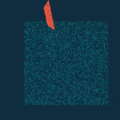

# 太极图形课S1-流体练习：一叶扁舟
[Taichi] version 0.8.5, llvm 10.0.0, commit 45c6ad48, win, python 3.9.1

## 背景简介
基于自带例子 mpm88.py、mpm128.py 修改得到。

课程是学习的是基于粒子的流体仿真，但是例程在笔记本上跑起来比较慢，所以换成了运行效率更高的自带例子。

在新的例子上，实现增加一叶质量非常棒的小木船，其特征在于随波逐流、飘摇沉浮。

和mpm128一样，鼠标左右键可以吸引和排斥。

效果如图。

## 成功效果展示
展示图片

自然下落：

遭遇龙卷风（下落后手动吸引）：

